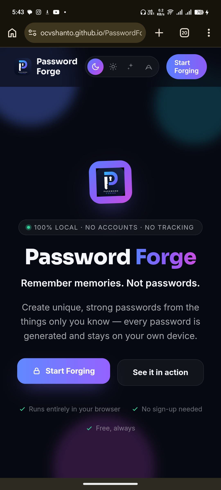
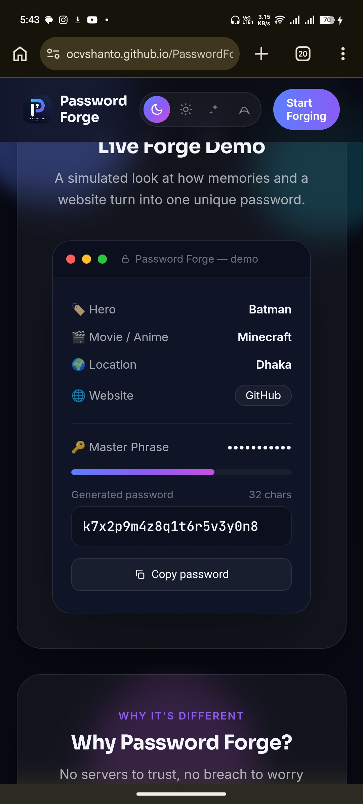
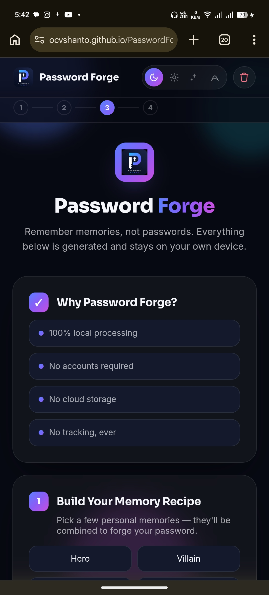

# 🔐 Password Forge

> **Remember memories, not passwords.**

**Password Forge** is a modern, privacy-first, deterministic password generator designed to help you create powerful and unique passwords without ever needing to remember or store them.

Instead of relying on password managers, cloud synchronization, or random password generation, Password Forge transforms **memories you already know** into secure passwords using modern cryptography. Everything happens **locally inside your browser**—your data never leaves your device.

No accounts.  
No servers.  
No cloud storage.  
No analytics.  
No tracking.  
Just you, your memories, and strong passwords.

---

# 🌟 Why Password Forge?

Most password generators create random passwords that you eventually have to save somewhere.

Password Forge takes a different approach.

You create a private "recipe" using memories only you know—such as:

- Childhood nickname
- Favorite movie
- Pet's name
- Important date
- Secret phrase

Combine that with a website name and your master phrase, and Password Forge deterministically creates the exact same strong password every time.

You never need to store the password.

You only need to remember your memories.

---

# ✨ Features

## 🔒 Privacy First

- 100% Client-side
- No internet connection required after loading
- No server communication
- No analytics
- No trackers
- No cookies
- No account required

---

## 🧠 Memory-Based Password Generation

Transform personal memories into deterministic passwords.

The same memories + same website + same settings = the same password every time.

---

## 🌐 Unique Password For Every Website

Even if you always use the same memories, every website receives an entirely different password.

This prevents password reuse across multiple services.

---

## ⚡ Powered by SHA-256

Uses the browser's built-in **Web Crypto API** (`crypto.subtle`) with SHA-256 to securely derive passwords.

No third-party cryptography libraries.

---

## 🎛️ Advanced Password Controls

Customize passwords exactly the way you want.

- Password length (8–64)
- Uppercase letters
- Lowercase letters
- Numbers
- Symbols
- Exclude confusing characters
- Prevent consecutive duplicate characters
- Guaranteed inclusion of enabled character types

---

## 🔄 Password Variants

Need another password for the same website?

Generate alternative deterministic variants while keeping your original memory recipe.

---

## ✅ Master Phrase Confirmation

Enter your master phrase twice to reduce typing mistakes before generating.

---

## 📋 One-Click Copy

Instantly copy generated passwords to your clipboard.

---

## 🗂 Session History

View recently generated passwords during the current browser session.

History is:

- Masked by default
- Never written to disk
- Automatically erased after reload

---

## 🚨 Panic Wipe

Need to clear everything instantly?

One click removes:

- Memory recipe
- Master phrase
- Generated password
- Session history

---

## 🎨 Beautiful Themes

Choose your favorite appearance.

- 🌙 Dark
- ☀️ Light
- ⚫ Midnight (AMOLED)
- 🌌 Aurora

---

## 📱 Mobile Friendly

Designed primarily for smartphones while remaining fully compatible with desktop browsers.

---

# 🌐 Live Demo

Official Website:

https://ocvpasswordforge.netlify.app/

GitHub Pages:

https://ocvSHANTO.github.io/PasswordForge/

---

# 📸 Screenshot

> Add a screenshot h

```






---

# 🛠 Built With

- HTML5
- CSS3
- Vanilla JavaScript
- Web Crypto API
- SHA-256

No frameworks.

No dependencies.

No build tools.

---

# 📂 Project Structure

```
PasswordForge/

├── index.html
├── PasswordForge_Final_Release-3.html
├── README.md
├── LICENSE
└── assets/
```

---

# 🚀 Getting Started

Clone the repository.

```bash
git clone https://github.com/ocvSHANTO/PasswordForge.git
```

Open the project.

```bash
cd PasswordForge
```

Simply open

```
index.html
```

inside any modern browser.

No installation.

No dependencies.

No server.

No build process.

---

# 💡 How It Works

1. Choose a few personal memories.
2. Enter the website or service name.
3. Configure your password settings.
4. Enter your master phrase.
5. Password Forge securely combines all inputs.
6. SHA-256 generates a deterministic password.
7. The same inputs always reproduce the same password.

Nothing is stored.

Nothing is uploaded.

Nothing leaves your browser.

---

# 🔒 Privacy

Password Forge follows one simple principle:

**Your data belongs to you.**

Therefore:

- No cloud storage
- No accounts
- No login
- No tracking
- No telemetry
- No analytics
- No advertisements
- No hidden requests

Every cryptographic operation runs locally using the browser's native Web Crypto API.

---

# 🛡 Security Notice

Password Forge is designed to generate deterministic passwords securely.

However, the overall security of your passwords depends on:

- Choosing memories that are difficult for others to guess.
- Keeping your master phrase secret.
- Avoiding obvious personal information.

The application never stores or backs up your password.

If you forget your memories or master phrase, your password cannot be recovered.

---

# 🌍 Browser Support

✅ Google Chrome

✅ Microsoft Edge

✅ Mozilla Firefox

✅ Brave

✅ Opera

✅ Safari

---

# 🚧 Roadmap

## Version 2

- ✅ Landing Page
- ✅ Password Generator
- ✅ Multiple Themes
- ✅ Session History
- ✅ Panic Wipe
- ✅ Password Variants

### Planned Features

- ⏳ Progressive Web App (PWA)
- ⏳ Recipe Import / Export
- ⏳ Password Strength Analysis
- ⏳ Multiple Language Support
- ⏳ Custom Theme Creator
- ⏳ Accessibility Improvements

---

# 🤝 Contributing

Contributions are welcome.

If you'd like to improve Password Forge:

1. Fork the repository.
2. Create a feature branch.
3. Make your changes.
4. Submit a Pull Request.

Bug reports, feature ideas, and improvements are always appreciated.

---

# ⚠️ Disclaimer

Password Forge is an independent open-source project provided **"as is"** without warranty of any kind.

The developer is not responsible for data loss caused by forgotten memories, incorrect inputs, or misuse of the software.

Always verify generated passwords before using them for important accounts.

---

# 📜 License

This project is licensed under the **MIT License**.

See the LICENSE file for complete details.

---

# 👤 Author

**Shanto**

🇧🇩 Bangladesh

GitHub

https://github.com/ocvSHANTO

Instagram

https://www.instagram.com/ocb__shanto

X (Twitter)

https://x.com/Junayed_SHANTO_

YouTube

https://youtube.com/@vortexinbloom

---

# ⭐ Support

If you found Password Forge useful,

please consider:

⭐ Starring the repository

🐛 Reporting bugs

💡 Suggesting new features

🤝 Contributing to the project

Every contribution helps make Password Forge even better.

---

## ❤️ Remember memories, not passwords.
